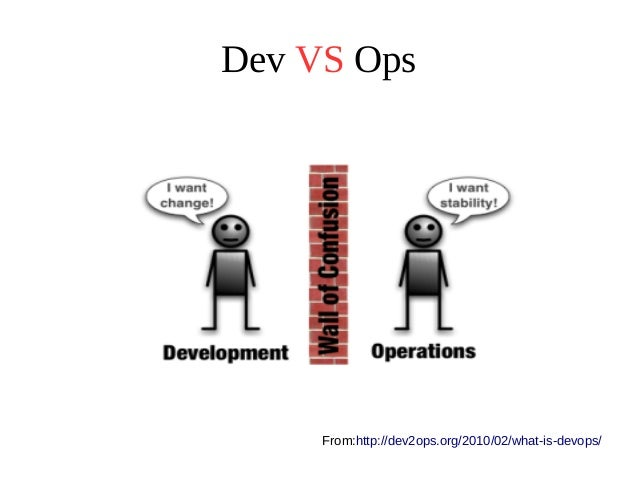
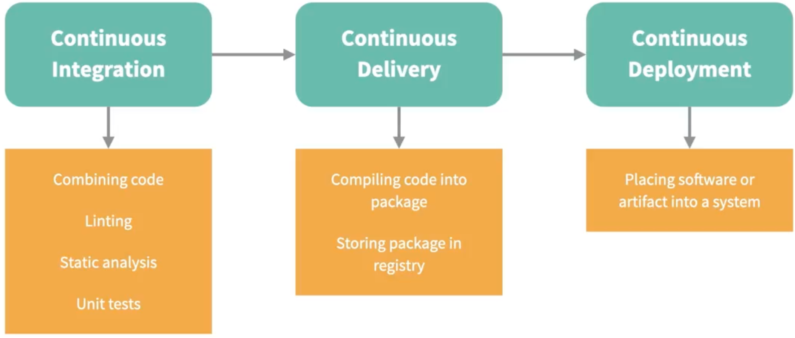
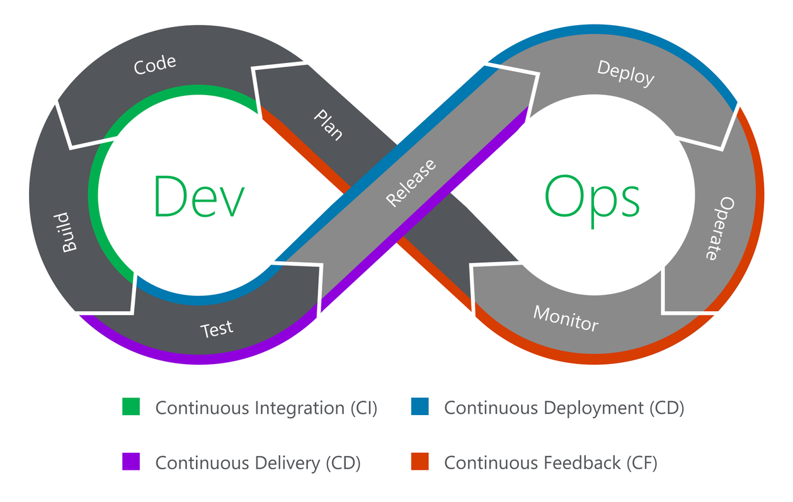

<div class="title-card">
    <h1>Welcome to Agil Udvikling</h1>
</div>

---

# About the course

[About The Course](../00._Meta_Course_Material/about_the_course.md)

---

# Problem? No Problem!

---

# Why Agile Development for an IT-architecture?

---

<!-- Git -->

<div class="title-card">
    <h1>Git(hub)</h1>
</div>

---

# Git vs. Github

<div style="display: flex; align-items: center;">
	
	
</div>

---

# Let's create a semester repository together!

Get the repository locally:

```bash
$ git clone <repository_url>
```

---

<div class="title-card">
    <h1>Let's learn how to push!</h1>
</div>

---

# Pushing, Step 1: Adding Files

Add all files:

```bash
$ git add -A
```
Add everything here and nested foloders:

```bash
$ git add . 
```

```bash
$ git add <filename\folder>
```

---

# Pushing, Step 2: Commiting Files

Commit with a message:

```bash
$ git commit -m "<message>"
```

---

# Pushing, Step 3:  Pushing to remote

Push the code to remote:

```bash
$ git push
```

---

# Try it out! - Let's update the README.md.

---

# Pulling

If others are working on the same repository, get the latest changes:

```bash
$ git pull
```

---


<!-- DevOps -->

<div class="title-card">
    <h1>DevOps</h1>
</div>

---

# Quick CI/CD pipeline demo

<!-- Todo put link here -->

---

# Historical View 

Before DevOps: release cycle: months - years

Ideal: Multiple times a day

Goal: How do we create infrastructure to reach the ideal without firefighting

Why? To bring value to the users

---

#  Dev vs. Ops

<div>
    
</div>

---

# DevOps Möbius strip

<div>
    
</div>

---

<!-- Git Breather -->

<div class="title-card">
    <h1>A Git breather</h1>
</div>

---

# Let's create a .gitignore and push it!

---


<!-- CI/CD/CD -->

<div class="title-card">
    <h1>CI/CD/CD</h1>
</div>

---

# CI/CD/CD

* Continuous Integration

Pushing code to a Version Control System (VCS such as git etc.).

* Continuous Delivery

Packaging your code (We will create Docker images).

* Continuous Deployment

Deploy to a server.

Most people just call it CI/CD. 

---

# CI/CD
Goal: automation. 
Term: Pipelines



---

# Discuss with a partner

In the DevOps 8, which part relate to CI, CD and CD?


<div>
    
</div>

---

# DevOps 8

<div>
    
</div>

Source: https://kapernikov.com/wp-content/uploads/2021/06/devops-8.png

---


<!-- YAML -->

<div class="title-card">
    <h1>YAML</h1>
</div>

---

# YAML

[YAML Tutorial](https://docs.ansible.com/ansible/latest/reference_appendices/YAMLSyntax.html)

---

# YAML Tutorial

If you are the type that learns best from videos try this out:

[](https://www.youtube.com/watch?v=1uFVr15xDGg&list=PLy7NrYWoggjxKDRWLqkd4Kbt84XEerHhB&index=6)

---


# Hands-on YAML!

---


<!-- Terminal -->

<div class="title-card">
    <h1>Terminal Commands</h1>
</div>

--- 
---


# Directories and moving

Output current directory (`pwd`):

```bash
$ pwd
```

Change into a directory (`cd`):

```bash
$ cd <directory>
```

Move one directory up (note: `..` is a special directory name that is the parent of the current directory):

```bash
$ cd ..
```

---

<div class="exercise-card" style="color: green;">
    <h1>Exercise</h1>
</div>

How do you move back into the directory?

---

# Listing files and directories

List directory contents (`ls`):

```bash
$ ls
```

List directory contents with details (`ls -l`):

```bash
$ ls -l
```

List directory contents with details and hidden files (`ls -la`):

```bash
$ ls -la
```

---

# Listing files in a directory

List files in a directory (`ls <directory>`):

```bash
$ ls <directory>
```

List files in this directory (note: `.` is a special directory name that refers to the current directory):

```bash
$ ls .
```

---

<div class="exercise-card" style="color: green;">
    <h1>Exercise</h1>
</div>

How do you list the files in the parent directory?

---

# Creating and deleting directories

Create a new directory (`mkdir`):

```bash
$ mkdir <directory_name>
```

Delete a directory (`rmdir`):

```bash
$ rmdir <directory_name>
```

Delete a directory (`rm -rf`):

```bash
$ rm -rf <directory>
```

---

<div class="exercise-card" style="color: green;">
    <h1>Exercise</h1>
</div>

Create a directory called `test`, move into it and create a directory called `test2`.
Now move back into the parent directory and delete `test2` and `test`.

---

# File handling:

Copy a file (`cp`):

```bash
$ cp <source> <destination>
```

Move or rename a file (`mv`):

```bash
$ mv <source> <destination>
```

Delete a file (`rm`):

```bash
$ rm <filename>
```


---


# Terminal commands - files (*nix):

Output hello:

```bash
$ echo hello
```

Create an empty file (`touch`):

```bash
$ touch <filename>
```

Display file contents (`cat`):

```bash
$ cat <filename>
```

---

# Terminal commands - files (Windows):

Create a new file (PowerShell):

```powershell
New-Item <filename> -ItemType "file"
```

Display file contents (PowerShell):

```powershell
Get-Content <filename>
```

---


<!-- Files-->


<div class="title-card">
    <h1>General info regarding files</h1>
</div>

---

# Tips regarding files

Avoid spaces in files and folders!

**Use Descriptive Names**: Choose file names that clearly indicate the content or purpose of the file.

**Avoid Special Characters**: Besides spaces, avoid using special characters like `/`, `\`, `:`, `*`, `?`, `"`, `<`, `>`, `|`, etc.

**Cross-Platform Compatibility**: If files will be used across different operating systems, consider compatibility (e.g., case sensitivity in file names in \*NIX vs. Windows).

---

# Hidden files and folders

**In *nix**, a file or folder is made hidden by prefixing its name with a dot `.`. For example, `.example`.

**In Windows**, the 'hidden' attribute is set on the file or folder, which can be done through file properties or using the command `attrib +h`.

Finder / Explorer can be configured to either show or hide hidden folders / files. 

---


# Folders and files that should never be pushed

JetBrains creates the `.idea` folder which is IDE preference specific. 

VSCode creates `.vscode` which contains user specific preferences and shouldn't be forced onto others. 

MacOS creates `.DS_Store` folders that relate to Finder settings. 

Windows creates `Thumbs.db`.

---

# Add to the global .gitignore: \*nix

Check if file exists:

```bash
$ git config --global core.excludesfile
```

Modify the file:

```bash
$ nano ~/.gitignore
```

Configure the file (tell Git to use it, remember to point correctly to the file):

```bash
$ git config --global core.excludesfile ~/.gitignore
```

---
# Add to the global .gitignore: Windows

Check if file exists:

```powershell
$ git config --global core.excludesfile
```

Modify the file:

```powershell
$ notepad C:\Users\YourUsername\.gitignore_global
```

Configure the file (tell Git to use it):

```powershell
$ git config --global core.excludesfile C:\Users\YourUsername\.gitignore_global
```

---

# Git advice - write proper commit messages - I

* **Clarity**: Explains changes for team members and future reference.
* **Tracking**: Aids in understanding project evolution and change history.
* **Review Efficiency**: Simplifies code reviews by clearly explaining changes.
* **Debugging Aid**: Helps pinpoint when and why changes were made for troubleshooting.
* **Documentation**: Acts as a record for future reference, helpful for new team members.
* **Professionalism**: Reflects disciplined, best practice approach in software development.

---

# Git advice - write proper commit messages - I

Personal suggestion:

`<past_tense_verb> + <action>`

Examples: 

- Refactored the integration test s

- Created a dark mode feature

- Implemented a POST /users route

Can you come up with commit messages that follow this structure?

---
# Quitting

Different programs have different ways to terminate them. These include:

```
q
```

```
:q
```

```
CTRL-C
```

```
CTRL-D
```

---

# Text Editors - Windows: 

No text editors for the terminal. 

```powershell
$ notepad <filename>
```

```powershell
$ code <filename>
```

---

# Text Editors in *nix Systems

#### **Nano**: Simple and User-Friendly.

#### **Vi/Vim**: Advanced and Powerful: Offers extensive functionality for complex editing tasks.

**Multiple Modes**:

- **Normal Mode**: Default mode for navigation and command execution.

- **Insert Mode**: Allows typing and editing text, similar to standard text editors.

- **Visual Mode**: Enables text selection using arrow keys; supports standard clipboard operations.

- **Visual Block Mode**: Facilitates block-shaped text selection and manipulation.


---


<!-- Final -->
# Ending comment

Please review this weeks slides as you get along the course. Some of the points will make more sense later on and the course meta description is worth refreshing on.
        
        