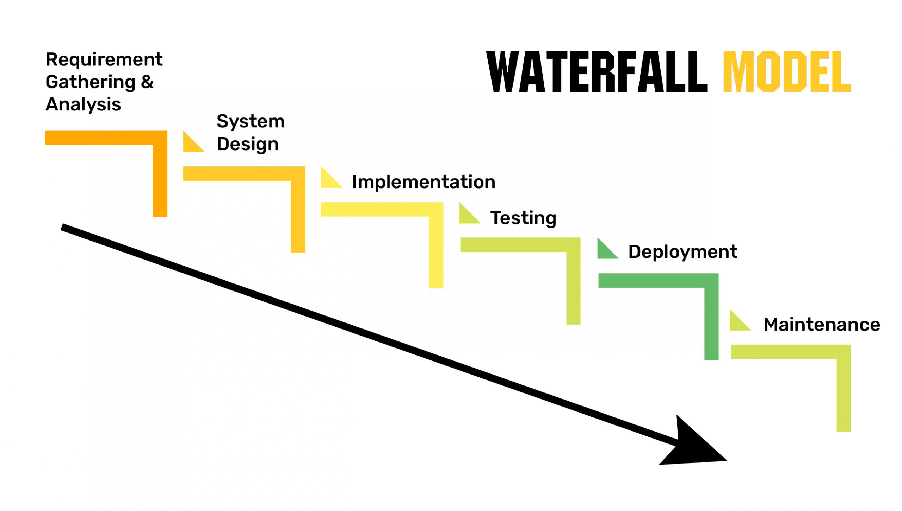
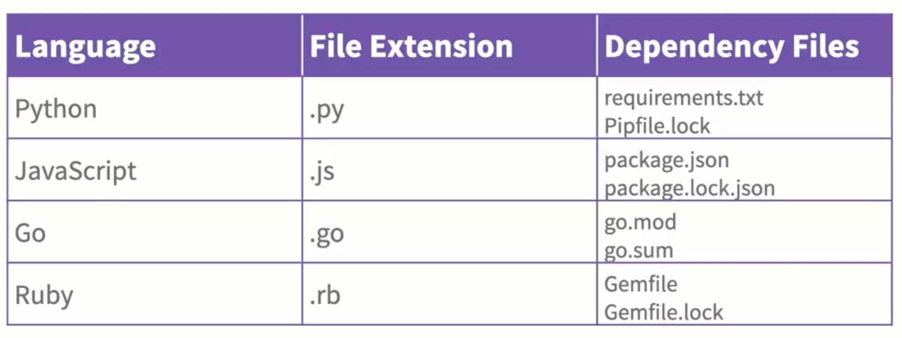
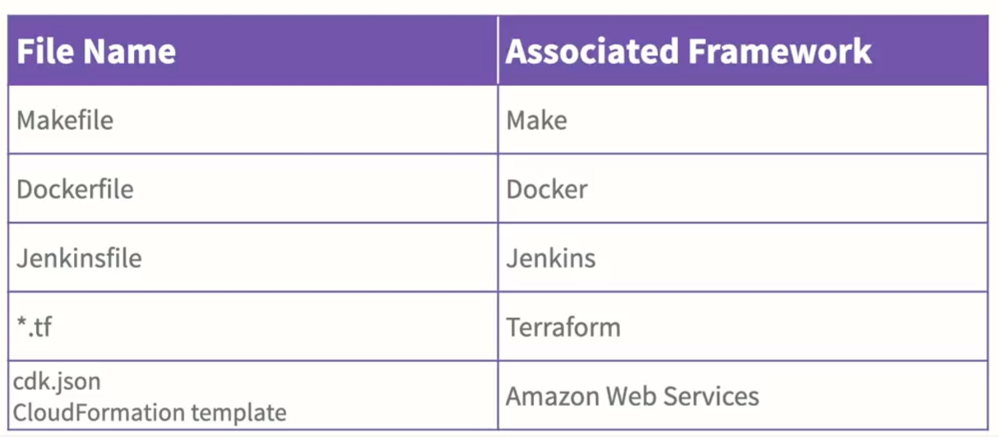

<div class="title-card">
    <h1>Agile and more...</h1>
</div>


---

<div class="title-card">
    <h1>What is Agile?</h1>
</div>

---

# Historical View: NOT! agile

Software __engineers__ created software **blueprints**.

Before you could even start implementing (coding) you had to do:

- Feasability study, Market research
- Risk analysis
- Requirement analysis
- Write thorough specification
- System and software design
- Feature extraction and estimation

---


# The waterfall model

<div>
    
</div>

Source: https://theincrowdvlog.com/article/8-fundamental-sdlc-models-every-developer-should-know-ishir

---

# Discuss: What are the problems with the waterfall model?

---

# Note: The waterfall model has its place

For some projects the waterfall model is the right choice. For instance, when there is only one iteration needed before the project is done. 

Also, analyzing and planning before coding is extremely important, especially for large systems. 

Agile development does not eliminate those steps.
Instead it allows one to move back and forth between the steps. 

---

# The Agile Manifesto

https://agilemanifesto.org/

---

# Video about The Agile Manifesto

[](https://www.youtube.com/watch?v=rf8Gi2RLKWQ)

(Sorry about the happy ukulele music.) 

---

# Let's be critical!

Research into the state of agile in the industry: 

https://www.itpro.com/software/agile-development-is-fading-in-popularity-at-large-enterprises-and-developer-burnout-is-a-key-factor

Problems: 

- Culture clash: Organizational resistance
- Lack of leadership support
- Siloed teams 

> “The larger the organization, the more likely it is to use a hybrid model,” the report said, noting that bigger teams are also more likely to still use waterfall.

The research still finds value in agile. It finds it to be best in small organizations. 

---

# Be critical of buzzwords in this industry

Many companies claim that they're agile when they're not. 


---

<!-- DevOps -->

<div class="title-card">
    <h1>DevOps</h1>
</div>


---

# What is DevOps? A short but informative video by Github.

[](https://www.youtube.com/watch?v=kBV8gPVZNEE)

---

# Why DevOps?

*DevOps is an easy sell because it is focused on creating value (for the business > for customers > for developers):*

Easy to make small changes and fix bugs ⇒ better product for user ⇒ business makes cash

Quicker way to deploy new features ⇒ competitive product on the market ⇒ business makes cash

Tests ensure robustness ⇒ production isn’t down ⇒ business makes cash

Server access isn’t given freely ⇒ better security means lesser chance of hacking ⇒ business makes cash

Infrastructure is reproducible ⇒ recovery takes minutes rather than days or weeks ⇒ business makes cash

---

# Literature: DevOps Handbook

<div>
    
</div>

---

# Literature: The Phoenix Project

<div>
    
</div>

---

# Reading: DevOps Handbook: History


---

# Reading: DevOps Handbook: Myths


---


<!-- Text editing in terminals -->

<div class="title-card">
    <h1>Text editing in terminals</h1>
</div>

--- 

# Text Editors - Windows: 

No text editors for the terminal. 

```powershell
$ notepad <filename>
```

```powershell
$ code <filename>
```

---

# Text Editors in *nix Systems

#### **Nano**: Simple and User-Friendly.

#### **Vi/Vim**: Advanced and Powerful: Offers extensive functionality for complex editing tasks.

**Multiple Modes**:

---

# Vim - Multiple Modes:

- **Normal Mode**: Default mode for navigation and command execution.

- **Insert Mode**: Allows typing and editing text, similar to standard text editors.

- **Visual Mode**: Enables text selection using arrow keys; supports standard clipboard operations.

- **Visual Block Mode**: Facilitates block-shaped text selection and manipulation.

---

<!-- Markdown -->

<div class="title-card">
    <h1>Markdown</h1>
</div>


---

# Markdown

## Basic Syntax:
- **Headers**: `#` for main headings, `##` for subheadings, etc. 
- **Emphasis**: `*italic*` or `_italic_`, `**bold**` or `__bold__`. 
- **Lists**: `-` or `*` for unordered lists, `1.`, `2.`, etc., for ordered lists. 
- **Links**: `[Text](URL)`. 
- **Images**: ``. 
- **Code**: \` \`Inline code\` \`, \`\`\` for code blocks.\`\` \`

---

# Markdown exercise I

Try the 10 minute markdown tutorial (click the cyan button to start):

https://commonmark.org/help/

---

# Markdown exercise II

Create a .md file and push it to your repository. 

It should contain a header and ## subheading. 

It should have italic and bold text. 

It should have a code snippet. 

Bonus: It should contain an image. 

---


<!-- Build tools -->

<div class="title-card">
    <h1>Build tools</h1>
</div>

---

# OS level package managers

* **Windows**: chocolatey

* **MacOs**: homebrew

* **Linux**: apt, yum, dnf, pacman, zypper, portage, rpm, snap, flatpak, nix 
 
---

# Programming Languages / Package managers

<div>
    
</div>

---

# Build tools / Build files

<div>
    
</div>


---

# PM2 - Running Node.js in production - Part I

Install PM2:

```bash 
$ npm install pm2 -g
```

Start the application:

```bash 
$ `pm2 start app.js`
```

List All Running Applications:
 
```bash
$ pm2 list
```

---

# PM2 - Running Node.js in production - Part II

Stop the application: 

```bash
$ pm2 stop <app_name_or_id>
```

Delete an Application from PM2's List:

```bash
$ pm2 delete <app_name_or_id>
```

---


<!-- Tools -->

<div class="title-card">
    <h1>Tools</h1>
</div>

---

# jq

#### Install: 
```bash
$ brew install jq
```

```powershell
$ choco install jq -y
```

Then try to run this:

```bash
$ echo '{"hello":123}' | jq
```

**Note**: The difference between `“` and `‘` matters!

---

# Github CLI

Let's install it:

https://cli.github.com/

Commands:

```bash
$ gh repo create
```

But this is required first (only once):

```bash
$ gh auth login
```


---


<!-- Advanced git -->

<div class="title-card">
    <h1>Advanced git</h1>
</div>


# Advanced git

```bash
$ git log —graph,
```

Commit sha:

```bash
$ git checkout <sha>
```

```bash
$ git checkout head
```

```bash
$ git checkout main
```

---


# Git stash

Stashing is helpful when you want to pull (requires uncommited file changes) but don't want to create a commit just yet. 

Stash (temprorarily shelve) changes:

```bash
$ git stash
```

Reapply the most recent stash:

```bash
$ git stash pop
```

It's also possible to stash by a name and apply a specific stash.

---

# When nothing else works...

"Just give me what is in the repository right now".
Warning: this throws away all your uncommited changes:

```bash
$ git reset --hard origin
```

---

# Git PR

[](https://www.youtube.com/watch?v=8lGpZkjnkt4)

---

# Watch me make a PR

---

# Make a PR to my PR repository - New files

Create a file that you are sure is unique. It can be any file type.
It can have any content you like. 

---

# Make a PR to my PR repository - New file content

Edit a single file. Let's experience all the ways that this can go wrong. 

---

<div class="exercise-card" style="color: green;">
    <h1>Pair exercise - Fork It!</h1>
</div>

1. Create a repository. 
2. Give this repository to your partner. 
3. The partner creates a file called message.txt containing a funny message. 
4. Now accept the Pull Request. 

Then switch roles!

---

<!-- Github actions -->

<div class="title-card">
    <h1>Github Actions</h1>
</div>

---

# Workflows from templates

Check out the actions tab in the repository to discover preset workflow templates. 

<div>
    
</div>


---

# Hello World workflow

Let's manually create a workflow that echoes "Hello World" on every push and PR.

1. Create a new repository. 

2. Create .github/workflows

3. In it, create a file called hello_world.yaml

---

# In hello_world.yaml 


```yaml
name: Hello world workflow

on:
    push:
        branches:
            - main
    pull_request:
        branches:
            - main
    workflow_dispatch:

jobs:
    hello: 
        runs-on: ubuntu-latest
        steps:
            - name: Hello world
              run: echo "Hello world"
              shell: bash
```
