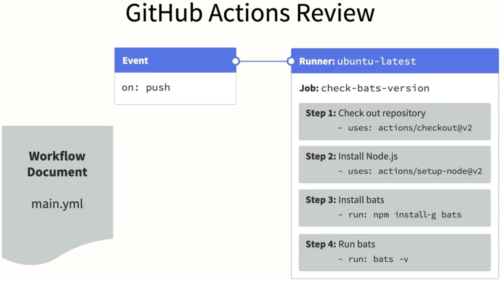

<div class="title-card">
    <h1>Github Actions</h1>
</div>

---

# A brief overview about our current tool stack


---

<!-- Reading -->


<div class="title-card">
    <h1>Reading</h1>
</div>

---

# Reading: The Phoenix Project - Excerpt


---


<!-- Git branching -->

<div class="title-card">
    <h1>Git branching</h1>
</div>

---

# Git branches

Create a new folder and in it run: `git init`:


List all branches:

```bash 
$ git branch
```

List all branches (including remote branches):

```bash 
$ git branch -a
```

There will be no branches to list at this point. 

You might need to press `q` to exit the list.

---

# List branches

Create a file and then commit on the main branch.

```bash
$ echo "test" > firstcommit.txt
$ git add firstcommit.txt
$ git commit -m "First commit"
```
Now try again. 

```bash 
$ git branch
```

You should see the main branch, although on Windows, it may still be called master.


---

# Creating new branches

Create a new branch:

```bash 
$ git checkout -b <branch-name>
```

This automatically switches to the new branch.

Switch to a branch: 

```bash 
$ git checkout <branch_name>
```

---

# Let's create a merge conflict - Step 1

Create a new folder and initialize it as a repository:

```bash 
$ git init
```

Create a new file with content:

```bash 
$ echo "Hello world" > example.txt
```

Add and commit the file:

```bash 
$ git add example.txt
$ git commit -m "Initial commit"
```

---

# Let's create a merge conflict - Step 2

Create a new branch:

```bash 
$ git checkout -b merge-conflict-branch
```

The new branch will have the file and content of the main branch.

Make changes in the new branch to the same file, same line:

```bash 
$ echo "Hello from feature branch" > example.txt 
$ git commit -am "Update message in feature branch"
```

---

# Let's create a merge conflict - Step 3

Checkout the main branch:

```bash 
$ git checkout main
```

**Status check**: So we have a file with different content in the main branch and the feature branch.

We want to have different content in the same line of the same file.

This is what will cause a merge conflict because git does not have a strategy for resolving this.


```bash 
$ echo "Main is changing the first line of example.txt" > example.txt 
$ git commit -am "Changed first line of example.txt"
```

---

# Let's create a merge conflict - Step 4

We are now going to merge the feature branch into the main branch.
    
```bash 
$ git merge merge-conflict-branch
```

This is the message:

```
Auto-merging example.txt
CONFLICT (content): Merge conflict in example.txt
Automatic merge failed; fix conflicts and then commit the result.
```

---

# Let's create a merge conflict - Step 5

There are many smart graphical tools for resolving merge conflicts.

Doing it manually is also an option. This is what the file looks like:

```
<<<<<<< HEAD
Main is changing the first line of example.txt
=======
Hello from feature branch
>>>>>>> merge-conflict-branch
```

Delete everything until there is only one line left (the one you want to keep or the combination of the two you want).

That's it! Now you can commit the changes.

---


<!-- Github Actions -->

<div class="title-card">
    <h1>Github Actions</h1>
</div>


---


# Github Actions

An Action creates an automation for code in repositories.

Run common tasks in repeatable fashion.


---

--- 

# CI / CD Platforms

- **Github**: Github Actions: 


- **BitBucket**: Atlassian Bamboo:


- **Gitlab**: Gitlab CI/CD:


---

--- 

# Why GitHub Actions?

+: You are already using Github

+: It’s free with some limitations (but the alternatives have the same limitation)
https://docs.github.com/en/billing/managing-billing-for-github-actions/about-billing-for-github-actions#included-storage-and-minutes

%: The free version is slow

---
--- 

# Github Actions Marketplace

Contains useful templates for Actions

Community Actions

Create custom actions and upload them to the marketplace


---

# Github Actions (terminology) - I

Event: Triggers that start a workflow

Workflows: Defines an automation from start to finish

Jobs: A workflow contains one or more jobs. A job is one or more steps.

Steps: Simple commands, shell scripts or actions.

Steps can’t run in parallel. Runs in sequence from top to bottom.

---
--- 

# Github Actions (terminology) - II

**Runner**: Compute layer where jobs are executed. Each job has its own runner.

Runners can run in parallel.

GitHub provides 3 types of runners: Ubuntu, Windows and MacOS.

Using a self-hosted runner is also possible.

Github runners comes with pre-installed tools, runtimes and compilers that require minimal configuration.

---

# Single Workflow - Overview I


---

# Overview II



---

# Great Video!

We will follow the content in class.

[](https://youtu.be/-hVG9z0fCac?list=PLArH6NjfKsUhvGHrpag7SuPumMzQRhUKY&t=138)

I don't find his other videos are as useful. (I mention this so you can better invest your time).

---

# Overview from the video


---


# Technical requirements:

Workflows must be stored in the .github/workflows folder.

Workflows are defined with YAML.

Workflows must define:

* Trigger and branches 
* Permissions
* Job and runner 
* Steps

---


# Workflows from templates

Check out the actions tab in the repository to discover preset workflow templates. 

<div>
    
</div>

---

# Choose an action from the marketplace

In the actions tab choose this workflow:


---

# The checkout action (actions/checkout@v3)

Allows one to checkout the repository. Id est, clone the repository code to the runner. 

Made by Github: https://github.com/actions/checkout

The following can be spicied: 

`@<tag>`, `@<branch>`, `@<commit sha>`

---

# Let's do it ourselves from scratch!

But this time manually (this is how we will be doing it from now on).

```bash
$ gh repo create

$ mkdir .github

$ cd .github

$ mkdir workflow

$ cd workflows
```

Create hello_world.yaml

---

# Warning regarding YAML

Frustratingly, it will fail because of spacing vs. tabs issues

Ensure that spacing is set to 2 spaces in your editor / IDE. 

Be careful about just copying file content from somewhere. 

---

# Hello World workflow

Let's manually create a workflow that echoes (logs) "Hello World" on every push and PR.

1. Create a new repository. 

2. Create .github/workflows

3. In it, create a file called hello_world.yaml

---

# In hello_world.yaml 


```yaml
name: Hello world workflow

on:
  push:
    branches: [main]
  pull_request:
    branches: [main]

jobs:
  hello:
    runs-on: ubuntu-latest
    steps:
      - uses: actions/checkout@v3
      - name: Run hello world
        run: echo "Hello world"
        shell: bash
```

---

# Let's study the above snippet - Can you spot the uneccessary part?

---

<div class="exercise-card" style="color: green;">
    <h1>Exercise - Get familiar with the UI</h1>
</div>

Click around and explore on your own.

(Raise your hands for help with debugging.) 

---

# workflow_dispatch

workflow_dispatch provides a UI button so that a workflow can be triggered in the Github UI without the above event triggers.

Under the `on` key add the following: 

```yaml
on: 
    workflow_dispatch:
```

---

<div class="exercise-card" style="color: green;">
    <h1>Exercise - Create a job named goodbye</h1>
</div>

It should echo `goodbye` after the hello job has run. 

Reminder: Never rerun the checkout action if a previous job has done that. 

---


<!-- Text editing in terminals -->

<div class="title-card">
    <h1>Text editing in terminals</h1>
</div>

---


# Text Editors - Windows: 

No text editors for the terminal. 

```powershell
$ notepad <filename>
```

```powershell
$ code <filename>
```

---

# Text Editors in *nix Systems

#### **Nano**: Simple and User-Friendly.

#### **Vi/Vim**: Advanced and Powerful: Offers extensive functionality for complex editing tasks.

**Multiple Modes**:

---

# Why is it useful to learn the Nano or Vim?

Even for people on Windows laptops.

---

# Install Nano and Vim on Windows:

Depending on your terminal you might already have them. 

You can test it by running `nano` or `vim`. Otherwise:

```bash
$ choco install nano
```

```bash
$ choco install vim
```

---

# Vim - Multiple Modes:

- **Normal Mode**: Default mode for navigation and command execution.

- **Insert Mode**: Allows typing and editing text, similar to standard text editors.

- **Visual Mode**: Enables text selection using arrow keys; supports standard clipboard operations.

- **Visual Block Mode**: Facilitates block-shaped text selection and manipulation.

---


<!-- Github Issues Workflow -->

<div class="title-card">
    <h1>Github Issues Workflow</h1>
</div>


--- 

# Let's try to automate publishing a comment every time an issue is created

What is a Github Issue? Why is auto-commenting useful?

---

# Github Actions - Context

Contexts inject useful information into the server environment. 

Can be accessed via `${{ <context> }}`.

https://docs.github.com/en/actions/learn-github-actions/contexts

For example, we can access repository meta information through `${{ github }} `. 

Let's look for where the issue number is defined. 

---

# Dump the context to examine it

```yaml
name: Create a comment on new issues

permissions:
    issues: write

on:
    issues:
        types: [opened]

jobs:
    comment:
        runs-on: ubuntu-latest
        steps:
            - name: "Dump Github context"
                run: echo '${{ toJson(github) }}' | jq
```

---

# Found it?

Under issue it is called "number". 

Note: toJson is a utility provided by Github Actions.

---
--- 

# Use the following package

https://github.com/marketplace/actions/create-or-update-comment

But replace issue-number: 1 with: ${{ github.event.issue.number }}

```yaml
        - name: Create comment
        uses: peter-evans/create-or-update-comment@v3
        with:
            issue-number: 1
            body: |
            This is a multi-line test comment
            - With GitHub **Markdown** :sparkles:
            - Created by [create-or-update-comment][1]

            [1]: https://github.com/peter-evans/create-or-update-comment
            reactions: '+1'

```

---


<!-- Using the Github API in workflows -->

<div class="title-card">
    <h1>Using the Github API in workflows</h1>
</div>

---

# Using the Github API in workflows

```yaml
comment-with-api:
        runs-on: ubuntu-latest
        steps:
        - name: Create comment with API
            run: |
            gh api -X POST \
                /repos/${{ env.ORGANIZATION }}/${{ env.REPOSITORY }}/issues/${{ env.ISSUE_NUMBER }}/comments \
                -f body='This is a multi-line test comment from the API'
            env:
            GITHUB_TOKEN: ${{ secrets.GITHUB_TOKEN }}
            ORGANIZATION: ${{ github.repository_owner }}
            REPOSITORY: ${{ github.event.repository.name }}
            ISSUE_NUMBER: ${{ github.event.issue.number }}
```


---


<!-- Next Week - Guest Lecture -->

<div class="title-card">
    <h1>Next Week - Guest Lecture</h1>
</div>

Now that we've started automating (CI), here is a repitition of the terms from week 1. This will be useful for next week. 

---

**CI / CD**

Continuous integration, continuous delivery, continuous development

---

#Continuous Integration (CI):

    - Developers frequently merge code changes into a central repository
    - Automatically builds and tests merged code
    - Detects integration issues early on
    - Goal: Resolve problems early and quickly

---

# Continuous Delivery (CD):

    - Ensures merged and tested code is always in a releasable state
    - Automated build process
    - Goal: To have code ready for release

---

# Continuous Deployment (CD):

    - Approach that emphasizes continuously delivering new features and improvements
    - Integrates feedback from users and stakeholders
    - Iterates on the product
    - Continuously deploys updates
    - Provides value at a faster pace
    
