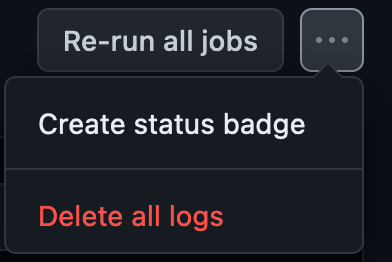

# Continuous Integration

---

<!-- CI / CD -->

<div class="title-card">
    <h1>CI / CD</h1>
</div>

---

**CI / CD**

Continuous integration, continuous delivery, continuous development

---

#Continuous Integration (CI):

    - Developers frequently merge code changes into a central repository
    - Automatically builds and tests merged code
    - Detects integration issues early on
    - Goal: Resolve problems early and quickly

---


<!-- Git Tagging and Github Releases -->

<div class="title-card">
    <h1>Git Tagging and Github Releases</h1>
</div>

---

# Git Tagging

This is useful for creating releases. 

Tag names follow semantic versioning. Example: v1.0

Example: 
```bash 
$ git tag <tag_name>
```

---

# Git Tagging - II

Annotated tag (acts like a commit): 

```bash 
$ git tag -a <tagname> -m "<tagging message>"
```

Pushing a tag to remote:

```bash 
$ git push origin <tagname>
```

---

# Github Release

This will be your homework. Let's have a brief look at the UI.


---


<!-- Git branching in agile teams -->

<div class="title-card">
    <h1>Git branching in agile teams</h1>
</div>

---

# Branching strategies

Why? To allow agile teams to collaborate. Branching strategies is an agreement on how agile teams collaborate and create production-ready releases.

Note: The past couple of years there has been an influx of new and shiny branching strategies that everyone suddenly *must* follow. This should give a clue that branching is a problem with no perfect solution. 

---

# Branching strategies 

- **Feature Branching**: Each feature is developed in a separate branch.

- **Gitflow**: A branching model that uses master, develop, feature, release, and hotfix branches.

- **Trunk-based Development**: All developers work on a single branch.  

- **Release Branching**: A branch is created for each release.

- **Environment Branching**: A branch is created for each environment (dev, test, prod).


---

# Monorepos

*The new old fad!*

Developers push code changes into a central repository. 

Mono comes from monolithic: 

> A related concept is the monolithic application, but whereas a monolith combines its sub-projects into one large project, a monorepo may contain multiple independent projects.[^1]

[^1]: Source: [Wikipedia - Monorepo](https://en.wikipedia.org/wiki/Monorepo)

---

# Discuss: Advantages and disadvantages of monorepos?

Hints: In relation to large-scale applications, team collaboration, developers individually, in the context of version control and CI/CD. 

---

# Great overview of advantages and disadvantages

https://en.wikipedia.org/wiki/Monorepo

---

# Monolithic applications vs. Microservices 

Note: that is not about monorepos. This relates to architecture. 

It's possible to have microservices in a monorepo. 

|                    | Monolithic          | Microservices               |
|--------------------|---------------------|-----------------------------|
| **Running**        | Single application | Many small, one-responsibility services |
| **Internal Communication** | Within the same program | Inter-service communication over a network |


Pros and cons?

---

# Monolithic applications vs. Microservices - Pros and Cons

|            | Monolithic Applications                    | Microservices                           |
|------------|--------------------------------------------|-----------------------------------------|
| **Pros**   | Simplicity in deployment and development.  | Scalability, flexibility, fault isolation.|
| **Cons**   | Scalability challenges, potential coupling.| Increased complexity in deployment, management.|


You will be creating a monolithic application this semester but a lot of companies are currently trying their hands on microservices. 

---


<div class="title-card">
    <h1>Continous Integration for Node.js</h1>
</div>

---

# A simple Node project

Let's create a new repository for creating out first Github Action. 

Create a Node.js project. 

```bash 
$ npm init -y
```

Define these scripts in package.json:

```json
"scripts": { 
    "build": "echo Building...", 
    "test": "echo Running tests..." 
}
```

Test it out! 

---

# Github Actions for Node.js - Part I

```yaml

This workflow will do a clean installation of node dependencies, cache/restore them, build the source code and run tests across different versions of node

```yaml
name: Node.js CI

on:
  push:
    branches: [ "main" ]
  pull_request:
    branches: [ "main" ]
```

---

# Github Actions for Node.js - Part II

```yaml
jobs:
  build:

    runs-on: ubuntu-latest

    strategy:
      matrix:
        node-version: [14.x, 16.x, 18.x]
        # See supported Node.js release schedule at https://nodejs.org/en/about/releases/

    steps:
    - uses: actions/checkout@v3
    - name: Use Node.js ${{ matrix.node-version }}
      uses: actions/setup-node@v3
      with:
        node-version: ${{ matrix.node-version }}
        cache: 'npm'
    - run: npm ci
    - run: npm run build --if-present
    - run: npm test
```


<!-- Linting -->

<div class="title-card">
    <h1>Linting</h1>
</div>

---

# Linting

Linters analyze code for potential errors, bugs, stylistic errors, and suspicious constructs. The key aspects of linting are:

**Automated Code Analysis**: Linters perform static analysis on the code without executing it.

**Error Detection**: Identifies programming errors, such as syntax errors or type mismatches.

**Code Quality and Consistency**: Checks for adherence to coding standards and conventions, ensuring consistency across the codebase.

**Improving Readability**: Helps in formatting code in a readable and maintainable way.

**Finding Potential Bugs**: Detects code patterns that are likely to be errors or could lead to bugs in the future.

---

# Popular linters

| Programming Language | Popular Linters                 |
|----------------------|---------------------------------|
| JavaScript           | ESLint, JSHint, JSLint          |
| Python               | Pylint, flake8, Pyflakes        |
| Java                 | Checkstyle, PMD, FindBugs       |
| C/C++                | Clang-Tidy, CPPLint, GCC        |
| Ruby                 | RuboCop, Reek                   |
| PHP                  | PHP_CodeSniffer, PHPMD          |
| CSS                  | Stylelint, CSSLint              |
| TypeScript           | TSLint, ESLint                  |
| Go                   | Golint, Gofmt, Go Vet           |
| Swift                | SwiftLint                       |
| Kotlin               | Ktlint, Detekt                  |
| Rust                 | Clippy                          |

---

# Let's lint a Node.js project

1. Let's make a Node.js project with intentional code style mistakes. 

2. Run locally: `npx standard --fix` 

We don't want to run --fix in the CI pipeline since it modifies code and the code in the CI pipeline does not update the code in version control.

---

# Git Hooks

The goal is always to catch problems as early as possible. 

We can disallow developers from pushing if their code isn't up to standard. 

Problem: Git Hooks must be manually defined on every machine. There is no way to push them into version control. 

Let's first try to create a `hello world` git hook. 

---

# Git Hooks - Linting with Standard


In the .git/hooks folder we can define hooks which are scripts that 

https://www.npmjs.com/package/standard#is-there-a-git-pre-commit-hook

---

# CI - Setup linting in lint.yaml

```yaml
lint:
    name: 'Run linter'
    defaults:
        run:
        shell: bash
        # Defines the working directory for all run steps in the workflow
        working-directory: ./web
    runs-on: ubuntu-latest
    steps:    
    - uses: actions/checkout@v2
        name: 'Checkout repository'
    
    - name: 'Install Dependencies'
        run: npm install

    - name: 'Run Linter'
        run: npx standard -v
```


---

# Super Linter

https://github.com/marketplace/actions/super-linter
    
    
        

---

# DevOps principle: Make your work visible

<div>
    
</div>

https://github.com/marketplace/actions/super-linter#add-super-linter-badge-in-your-repository-readme