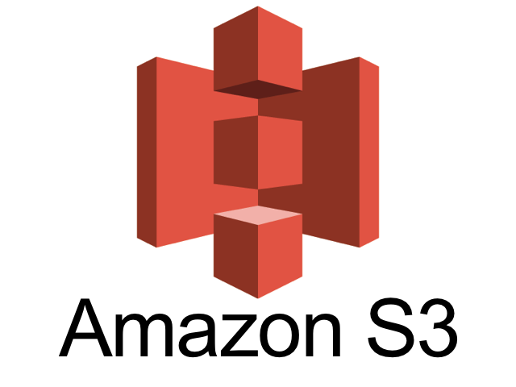
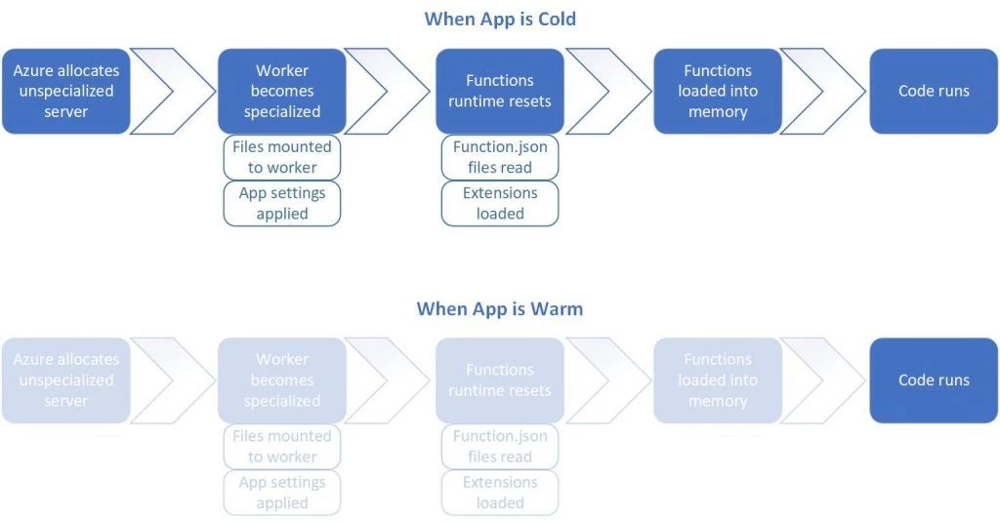
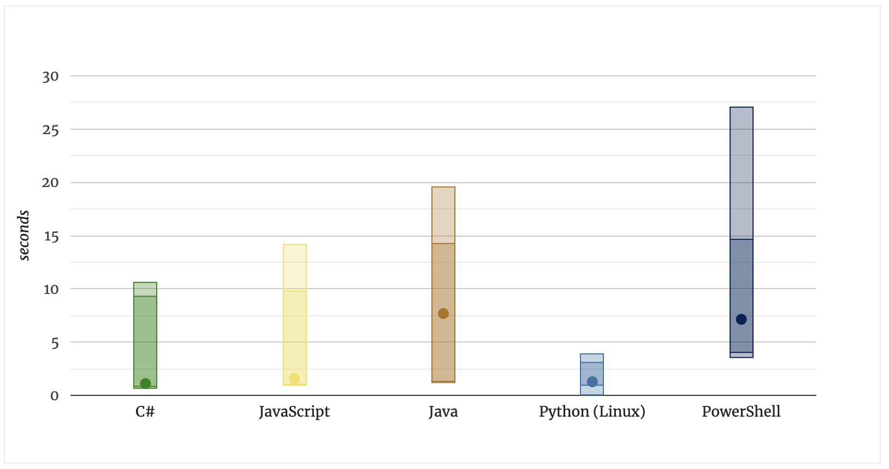

<div class="title-card">
    <h1>Cloud</h1>
</div>

---


--- 

# Cloud Providers

<div>
    
</div>


---

# Deployment models

- Public

- Private (on-premise)

- Hybrid

---

# Cloud service model

<div>
    
</div>


Source: imelgrat.me

---

# Cloud Service Model - Part I

- **SaaS (Software as a Service)**
    - Delivers applications over the internet.
    - Users access software from web browsers.
    - Examples: Google Workspace, Salesforce.

- **FaaS (Function as a Service)**
    - Enables running code in response to events.
    - Serverless execution; no need to manage servers.
    - Examples: AWS Lambda, Azure Functions.


---

# Cloud Service Model - Part II

- **DaaS (Desktop as a Service)**
    - Provides virtual desktop environments.
    - Hosted and managed by a third party.
    - Examples: Amazon WorkSpaces, VMware Horizon Cloud.

- **PaaS (Platform as a Service)**
    - Offers hardware and software tools over the internet.
    - Typically used for applications development.
    - Examples: Google App Engine, Heroku.

---
    
# Cloud Service Model - Part III

- **STaaS (Storage as a Service)**
    - Provides data storage as a service.
    - Accessible through a network (commonly the internet).
    - Examples: Google Cloud Storage, Dropbox.

- **IaaS (Infrastructure as a Service)**
    - Offers fundamental computing resources.
    - Includes virtual machines, storage, and networks.
    - Examples: Amazon EC2, Microsoft Azure.

---

# From now on the focus is Azure

---

# Azure data centers

<div>
    
</div>


---

# Cost management - I

Set limitation on spending. 

Page 7: 

https://docs.google.com/document/d/1vJu2XiBDSuuFPt5j70RdFc6ERA4HEl0eTmqq3sL1sR0/edit

---

# Cost management - II

Important!

Please beware that even if no services are running, if a resource group exists it can still use a lot of money. Delete resource groups when not in use. 

Network Watcher:

https://learn.microsoft.com/en-us/azure/network-watcher/network-watcher-overview

---

# Cost management - III

When possible use free services. 

<div>
    
</div>

---

# Virtual Machines

Let's create a virtual machine (through free services). 

But first let's generate an SSH key for logging in. 

---

# Generating a SSH-key

Generate a 4096-bit RSA SSH-key pair. 

*nix (tldr ssh-keygen):

```bash
$ ssh-keygen -t rsa -b 4096 -C "comment|email”
```

Windows (2048-bit RSA key is the default): 

```powershell
$ ssh-keygen -m PEM -t rsa -b 4096
```

https://learn.microsoft.com/en-us/azure/virtual-machines/linux/create-ssh-keys-detailed

---

# Let's create a virtual machine

Various OS to choose from.

And ssh into it. 

---

# Let's tear it down

Let's stop it and delete the resource group!

---

# VPC / VNET

VPC: Virtual Private Cloud (often associated with AWS)
VNET: Virtual Network (Azure's term)
I will use the generic term VPC in class.

A VPC is an isolated cloud network within a public cloud environment.
Allows cloud services in the same data center to communicate securely without going through the public internet. 
Provides control over IP address ranges, subnets, network gateways, and security settings.

---

# VPC security (NACL)

NACL (Network Access Control Layer):

- NACL

- SG (Security Groups)

- Firewall

---

# Subnets

Private subnets

Public subnets

---

# Gateways

IG (internet gateway)

VPC Peering (connect multiple VPCs)

NAT (allows devices in the VPC to connect to the internet)

--- 

# Application Layer

NLB (Network Load Balancer)

ALB (Application Load Balancer)

---

# Example of a pro setup


---

# Virtual Machines

<!-- TODO .... -->
<!-- todo how to run a simple webapp and open a port in the security group https://www.youtube.com/watch?v=w8H5fWBHddA  -->

---

# Cloud storage

AWS: S3 (Simple Storage Service)



Azure: Azure Blob Storage


---

# Azure Blob Storage

<!-- TODO  how to setup, upload and permissions-->

--- 

# AWS S3 policies

Policy Generator: 

https://awspolicygen.s3.amazonaws.com/policygen.html

---

# Serverless computing


---

# Why serverless?

Saves time. Easier to deploy.

Scalable. 

Saves money. (Azure Functions Different pricing plans.)


---

# Azure Functions - subscription models

* **Consumption plan**: Pay for the time that your code runs.

* **Premium plan**: You specify a number of pre-warmed instances that are always online. 

* **App service plan**: Run as if they are web apps. Not serverless.

---

# Azure Functions - Ways to deploy

* In the browser.

* Terminal. 

* Visual Studio (extension).

* VSCode.

---

# Tools for local development

Tools: 

- CLI
- Visual Studio
- VS Code (extension)
- Storage emulators (local)

---

# Cold starts - A problem

Cold start: The time it takes to allocate the function to a server and setup the runtime environment before your code can run.

Functions are held warm for roughly 20 minutes according to below source.





(Source: https://azure.microsoft.com/en-us/blog/understanding-serverless-cold-start/)

---

# More cold start metrics




(Source: https://mikhail.io/serverless/coldstarts/azure/)

---

# Triggers and bindings

https://learn.microsoft.com/en-us/azure/azure-functions/functions-triggers-bindings?tabs=isolated-process%2Cpython-v2&pivots=programming-language-csharp#supported-bindings

---

# Let's create an Azure function in the portal

Must create a Function App. A Function App can contain multiple functions. 
Must associate storage with a Function App.

To call with name key defined in the query string:
Set the authentication level to anonymous either in integration or function.json.
Use the Function key [default] URL. 

---

# Azure Key Vault

A way to store values outside of the code such as environment variables. 

Can be used to authenticate services. 
Also useful for authorization. Access policies can limit usage.

Example use case:
Define the database connection string here. Functions can then get the connection string from the Key Vault. Now it’s removed from the code and can be changed in one place.


---

# Let's create a Key Vault

<!-- todo  -->

---

# Azure Service Bus

---

# Azure Service Bus - Queues

https://www.youtube.com/watch?v=ZV4gjVVhee0


---

# Azure Service Bus - Topics

https://www.youtube.com/watch?v=kfjUSibSico


---

# Ways to work with cloud services

From okay to best:

1. Console UI (Clicking)

2. CLI / API (Shell, Bash)

3. SDK/CDK (Software/Cloud Development Clip) (Custom code scripts in programming languages)

4. IaC (Framework for provisioning of resources, Declarative, Prescriptive)

    

